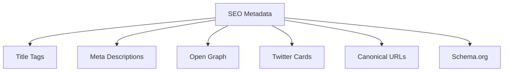
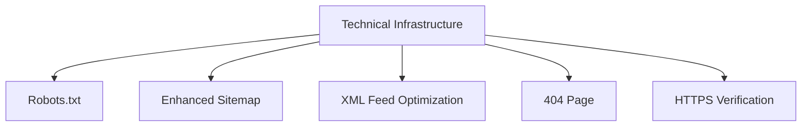
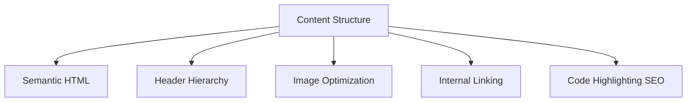
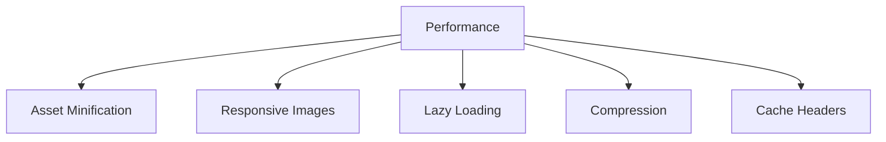
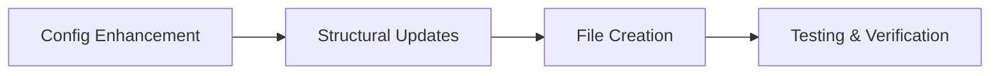

# Technical SEO Optimization Plan for peschinskiy.github.io

## Current State Analysis

Your blog currently has:
- Jekyll on GitHub Pages platform
- Basic SEO plugins: jekyll-seo-tag, jekyll-sitemap, jekyll-feed
- Clean URL structure with /:title/ permalinks
- Responsive design foundation
- Good basic HTML structure with proper heading hierarchy
- Content organization through categories and tags

## Areas for Technical SEO Improvement

### 1. Enhanced Metadata Configuration

While you have the jekyll-seo-tag plugin installed, we can enhance its configuration for better search engine interpretation:



**Recommendations:**
- Expand `_config.yml` with additional SEO-specific fields
- Add structured data (JSON-LD) for blog posts
- Implement custom front matter variables for more granular SEO control
- Ensure proper page-specific metadata

### 2. Technical Infrastructure



**Recommendations:**
- Create a custom robots.txt file
- Enhance sitemap.xml with additional metadata
- Create a custom 404 page with helpful navigation
- Ensure HTTPS is properly configured (already handled by GitHub Pages)

### 3. Content Structure Optimization



**Recommendations:**
- Enhance semantic HTML elements in templates
- Ensure proper heading hierarchy (h1 → h2 → h3)
- Add alt text and lazy loading for images
- Implement an internal linking strategy
- Optimize code block rendering for SEO

### 4. Performance Optimization



**Recommendations:**
- Minify CSS and JavaScript
- Implement responsive image handling
- Add lazy loading for images
- Ensure proper compression (Jekyll/GitHub Pages handles most of this)

## Implementation Plan

The implementation will follow these steps:



### 1. Configuration Enhancement
- Update `_config.yml` with expanded SEO settings
- Add social media profiles configuration
- Configure defaults for content types

### 2. Structural Updates
- Enhance default.html with structured data
- Add canonical URL handling
- Improve semantic HTML structure

### 3. File Creation
- Create robots.txt
- Create JSON-LD templates for blog posts
- Create a custom 404 page

### 4. Testing & Verification
- Validate structured data using Google's Structured Data Testing Tool
- Check mobile-friendliness using Google's Mobile-Friendly Test
- Verify indexability using Google Search Console
- Test site speed using PageSpeed Insights

## Specific Technical Implementations

### Enhanced _config.yml

```yaml
# Current settings
title: Igor Peschinskiy
email: igor.peschinskiy@gmail.com
description: >-
  Personal technical blog about IT-relevant topics

# Additional SEO settings to add
author:
  name: Igor Peschinskiy
  twitter: peschinskiy
  # Add other social profiles

# Social settings for jekyll-seo-tag
twitter:
  username: peschinskiy
  card: summary_large_image
  
social:
  name: Igor Peschinskiy
  links:
    - https://github.com/peschinskiy
    - https://linkedin.com/in/peschinskiy
    - https://twitter.com/peschinskiy

# Google Analytics (if desired)
google_analytics: # UA-XXXXXXXX-X

# Logo for SEO
logo: /assets/images/logo.png

# Default image for social sharing
defaults:
  - scope:
      path: ""
    values:
      image: /assets/images/default-social.jpg
```

### robots.txt

```
User-agent: *
Allow: /

Sitemap: https://peschinskiy.github.io/sitemap.xml
```

### JSON-LD Template for Posts

Add to `_layouts/post.html`:

```html
<script type="application/ld+json">
{
  "@context": "https://schema.org",
  "@type": "BlogPosting",
  "headline": "{{ page.title }}",
  "datePublished": "{{ page.date | date_to_xmlschema }}",
  "dateModified": "{{ page.last_modified_at | default: page.date | date_to_xmlschema }}",
  "author": {
    "@type": "Person",
    "name": "{{ site.author.name }}"
  },
  "mainEntityOfPage": {
    "@type": "WebPage",
    "@id": "{{ page.url | absolute_url }}"
  },
  
  "image": {
    "@type": "ImageObject",
    "url": "{{ page.image | absolute_url }}"
  },
  
  "publisher": {
    "@type": "Organization",
    "name": "{{ site.title }}",
    "logo": {
      "@type": "ImageObject",
      "url": "{{ site.logo | absolute_url }}"
    }
  },
  "description": "{{ page.excerpt | strip_html | strip_newlines | truncate: 160 }}"
}
</script>
```

### Custom 404 Page (404.md)

```markdown
---
layout: page
title: Page Not Found
permalink: /404.html
---

# Oops! Page Not Found

The page you were looking for doesn't exist. You may have mistyped the address or the page may have moved.

## Here are some helpful links:

- [Go back to homepage](/)
- [Check out my recent posts](/#recent-posts)
- [Learn more about me](/about/)