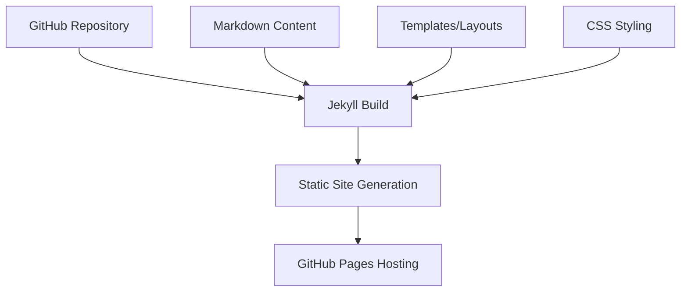
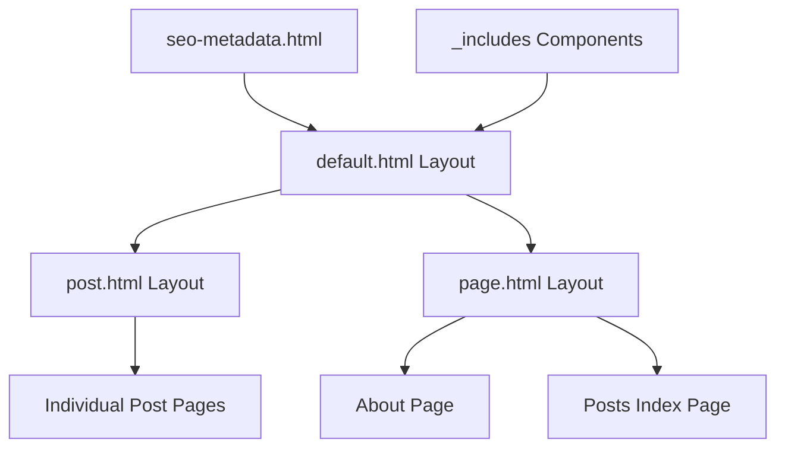
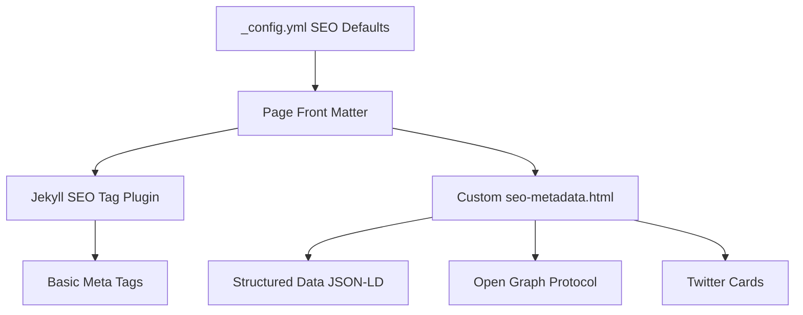

# System Patterns

## Architecture Overview
The blog is structured as a static site built with Jekyll and hosted on GitHub Pages, following a content-first architecture pattern that prioritizes simplicity, performance, and maintainability.

## Key Design Patterns

### Content Organization
- **Post Collection**: Blog posts are organized as Jekyll collections, with each post as a separate markdown file
- **Front Matter**: Each post uses YAML front matter for metadata such as title, date, categories, and tags
- **Excerpt Pattern**: First paragraph of each post serves as an automatic excerpt on the main page

### Site Structure
- **Header-Content-Footer**: Consistent layout structure across pages
- **Navigation Bar**: Persistent header navigation with Posts and About links
- **List-Detail Pattern**: Posts page shows list view, with individual post pages as detail views
- **Sitemap Architecture**: Both XML (for search engines) and HTML (for users) sitemaps
- **Error Handling**: Custom 404 page with navigation assistance

### SEO Implementation
- **Structured Data Pattern**: JSON-LD implementation for machine-readable content
- **Component-based SEO**: Includes file for standardized metadata
- **Hierarchical Metadata**: Cascading metadata from site level to page/post level
- **Social Sharing Integration**: Platform-specific metadata for Twitter and Open Graph

## Component Relationships

### Template Inheritance

### SEO Structure

### Content Flow
- Markdown files → Jekyll processing → HTML generation
- Post metadata → Index generation → List display
- Post content → Individual page rendering
- Structured data → SEO enhancement → Search engine visibility
- Site metadata → Social sharing optimization

## Technical Decision Points

### Static Site Generation
- Pre-build all pages rather than server-side rendering
- No database dependencies, all content stored in repository
- Minimize client-side JavaScript to focus on content delivery

### Responsive Design
- Mobile-first approach to CSS
- Fluid typography that scales with viewport
- FiraCode font for code blocks
- Breakpoints for major device categories (mobile, tablet, desktop)
- Component adaptability across screen sizes (e.g., header collapse)

### Performance Optimization
- Lightweight design with minimal assets
- Image optimization for faster load times
- Efficient caching through GitHub Pages
- Preconnect for external resources
- Font loading optimization

### SEO Architecture
- Semantic HTML structure with schema.org attributes
- Standardized metadata patterns across all pages
- Structured data implementation with JSON-LD
- Social media optimization with platform-specific metadata
- Accessibility considerations for improved rankings
